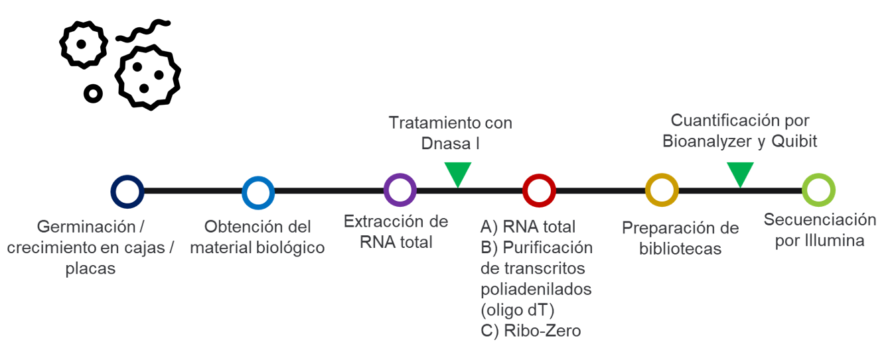
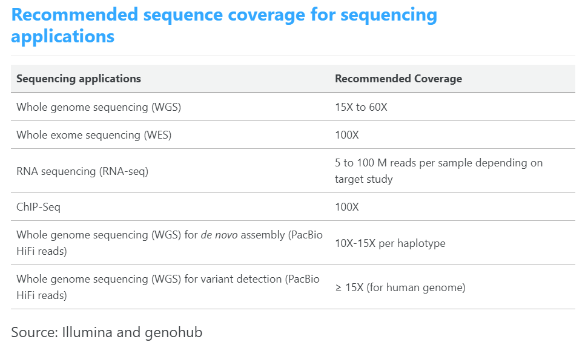
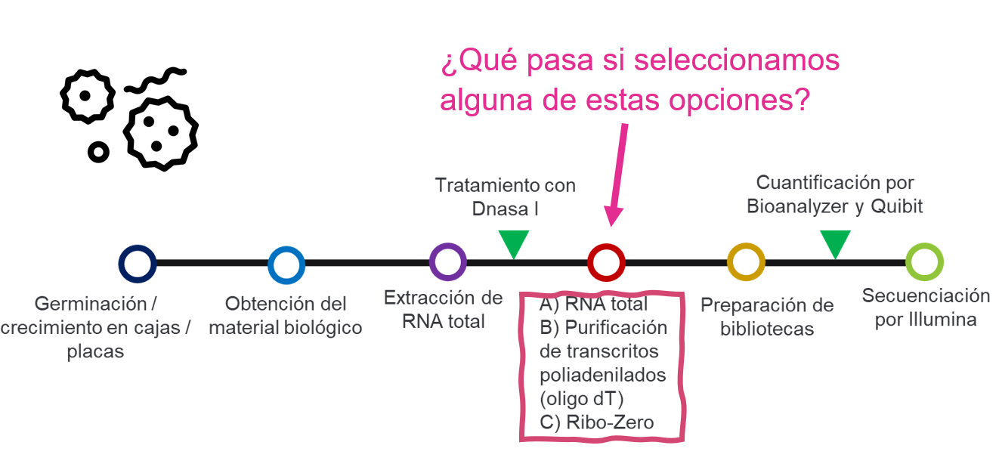
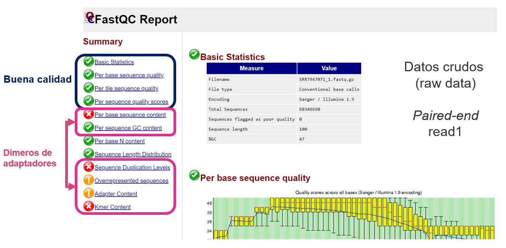
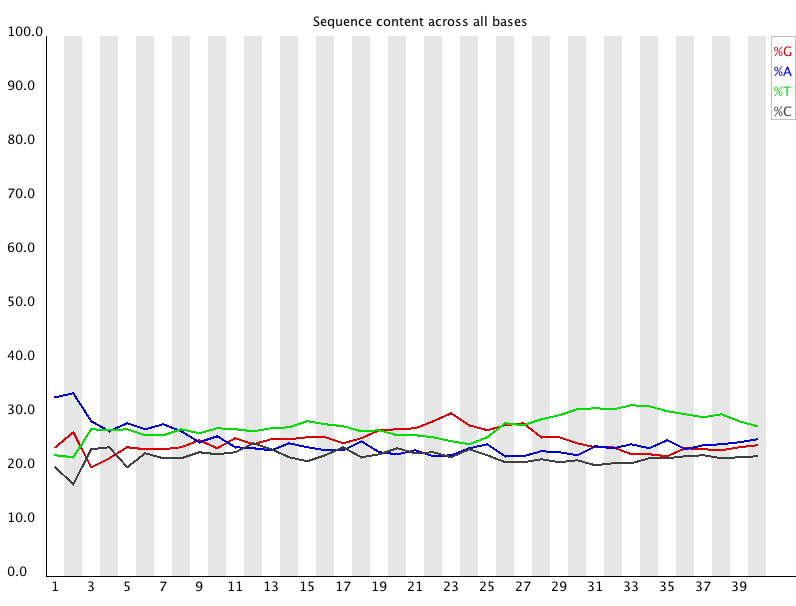

```{r setup, include = FALSE}
# Setup chunk
# Paquetes a usar
#options(htmltools.dir.version = FALSE) cambia la forma de incluir código, los colores

library(knitr)
library(tidyverse)
library(xaringanExtra)
library(icons)
library(fontawesome)
library(emo)

# set default options
opts_chunk$set(collapse = TRUE,
               dpi = 300,
               warning = FALSE,
               error = FALSE,
               comment = "#")

top_icon = function(x) {
  icons::icon_style(
    icons::fontawesome(x),
    position = "fixed", top = 10, right = 10
  )
}

knit_engines$set("yaml", "markdown")

# Con la tecla "O" permite ver todas las diapositivas
xaringanExtra::use_tile_view()
# Agrega el boton de copiar los códigos de los chunks
xaringanExtra::use_clipboard()

# Crea paneles impresionantes 
xaringanExtra::use_panelset()

# Para compartir e incrustar en otro sitio web
xaringanExtra::use_share_again()
xaringanExtra::style_share_again(
  share_buttons = c("twitter", "linkedin")
)

# Funcionalidades de los chunks, pone un triangulito junto a la línea que se señala
xaringanExtra::use_extra_styles(
  hover_code_line = TRUE,         #<<
  mute_unhighlighted_code = TRUE  #<<
)

# Agregar web cam
xaringanExtra::use_webcam()
```

```{r xaringan-editable, echo=FALSE}
# Para tener opciones para hacer editable algun chunk
xaringanExtra::use_editable(expires = 1)
# Para hacer que aparezca el lápiz y goma
xaringanExtra::use_scribble()
```

```{r xaringan-themer Eve, include=FALSE, warning=FALSE}
# Establecer colores para el tema
library(xaringanthemer)
#style_xaringan(
style_duo_accent(
  background_color = "#FFFFFF", # color del fondo
  link_color = "#562457", # color de los links
  text_bold_color = "#0072CE",
  primary_color = "#01002B", # Color 1
  secondary_color = "#CB6CE6", # Color 2
  inverse_background_color = "#00B7FF", # Color de fondo secundario 
  
  # Tipos de letra
  header_font_google = google_font("Barlow Condensed", "600"), #titulo
  text_font_google   = google_font("Work Sans", "300", "300i"), #texto
  code_font_google   = google_font("IBM Plex Mono") #codigo
  #text_font_size = "1.5rem" # Tamano de letra
)

# https://www.rdocumentation.org/packages/xaringanthemer/versions/0.3.4/topics/style_duo_accent
```

class: title-slide, middle, center
background-image: url(figures/Slide1.png) 
background-position: 90% 75%, 75% 75%, center
background-size: 1210px,210px, cover


.center-column[
# `r rmarkdown::metadata$title`
### `r rmarkdown::metadata$subtitle`

####`r rmarkdown::metadata$author` 
#### `r rmarkdown::metadata$date`
]

.left[.footnote[R-Ladies Theme[R-Ladies Theme](https://www.apreshill.com/project/rladies-xaringan/)]]

---
background-image: url(figures/liigh_unam_logo.png) 
background-position: 10% 10%
background-size: 10%
class: middle, center


# Sobre mi
----

.left-col[

### `r fontawesome::fa("dna", fill = "#181818")` Dra. Evelia Lorena Coss-Navarrete

Investigadora Posdoctoral en el Laboratorio Internacional de Investigación sobre el Genoma Humano [(LIIGH), UNAM](https://twitter.com/LIIGH_UNAM), campus Juriquilla


[`r fontawesome::fa("link")` Dra Alejandra Medina-Rivera](https://liigh.unam.mx/profile/dra-alejandra-medina-rivera/)

[`r fontawesome::fa("github")` EveliaCoss.github.io](https://eveliacoss.github.io/)

]


.center-col[


### `r fontawesome::fa("star", fill = "#181818")` Miembro

- [LupusRGMX](https://twitter.com/LupusRgmx)

- [Proyecto JAGUAR](https://twitter.com/PJaguarLATAM)

- [Rladies Morelia](https://www.facebook.com/profile.php?id=100093337606435)

- [CDSB - Mexico](https://twitter.com/CDSBMexico)

- [RIABIO](https://twitter.com/RiaBioNet)
]


.right-col[

### `r fontawesome::fa("circle-nodes", fill = "#181818")` Formación académica

- Doctorado en Biotecnología de Plantas, [Cinvestav, Langebio](https://twitter.com/uga_langebio),  [`r fontawesome::fa("link")` Dra Selene Fernandez-Valverde](https://twitter.com/SelFdz)

- Maestría en Biotecnología de Plantas, [Cinvestav, Unidad Irapuato](https://twitter.com/CinvestavIra)

- Ing. en Biotecnología, [UPSIN](https://www.facebook.com/UPSINSINALOA)

]

---

## Objetivo del curso: 
----

.center[
Hacer de ustedes **bioinformáticos** aptos en sus nuevos laboratorios. 
]

```{r, echo=FALSE, out.width='60%', fig.align='center'}

```

---
## Bioinformática se conforma de la computación, biológica, matemáticas y estadística


La bioinformática, en relación con la **genética y la genómica**, es una **subdisciplina científica** que implica el uso de **ciencias informáticas** para *recopilar, almacenar, analizar y diseminar datos biológicos*, como secuencias de ADN y aminoácidos o anotaciones sobre esas secuencias [NIH, 2023](https://www.genome.gov/es/genetics-glossary/Bioinformatica). 

---

class: inverse, center, middle

`r fontawesome::fa("laptop-file", height = "3em")`
# Aspectos generales de RNA-Seq

---
# Transcriptoma

Es el conjunto de todas las moléculas de RNA producidos por el genoma bajo **condiciones específicas** o en **una célula específica (scRNA-Seq)** o en **una población de células (bulk RNA-Seq)**. 

### ¿Porque es importante medir los cambios en la expresión génica (transcriptoma)?

- Las variaciones en la expresión entre condiciones se puede relacionar con los cambios en los **procesos biológicos**.

- El transcriptoma nos da una aproximación de los cambios relativos en la expresión génica de los **genes codificantes y no codificantes**.

.content-box-gray[
Palabras claves: 
- Genoma - Fijo  
- Transcriptoma - Altamente variable
]

---
## El transcriptoma varía según:

.pull-left[
- Tejido / Órgano
- Célula 
- Ambiente (estrés)
- Medicamentos (tratamientos)
- Salud
- Edad
- Etapa del desarrollo
]

.pull-right[
```{r, echo=FALSE, out.width='90%', fig.align='center'}

```
]

---

### Idea principal de RNA-Seq

## Relacionar un fenotipo con los cambios de expresión de los genes en una condición dada

```{r, echo=FALSE, out.width='80%', fig.align='center'}

```

.left[.footnote[.black[
Imagen tomada de: https://www.acobiom.com/en/rna-seq-en/
]]]

---
# Flujo experimental de RNA-Seq
----

```{r, echo=FALSE, out.width='100%', fig.align='center'}

```

---

class: inverse, center, middle

`r fontawesome::fa("barcode", height = "3em")`
# Consideraciones sobre la planificación experimental

---

# Número de replicas

Las réplicas experimentales pueden realizarse como **réplicas técnicas** o **réplicas biológicas**.


```{r, echo=FALSE, out.width='50%', fig.align='center'}
knitr::include_graphics("figures/replicates.png")
```

- **Réplicas técnicas**: utilizan la misma muestra biológica para repetir los pasos técnicos o experimentales con el fin de medir con precisión la variación técnica y eliminarla durante el análisis.

- **Réplicas biológicas**: utilizan diferentes muestras biológicas de la misma condición para medir la variación biológica entre muestras.

.left[.footnote[.black[
Imagen proveniente de [Klaus, et al. 2015. EMBO](https://dx.doi.org/10.15252%2Fembj.201592958); [Introduction to RNA-Seq using high-performance computing](https://hbctraining.github.io/Intro-to-rnaseq-hpc-salmon/lessons/experimental_planning_considerations.html)
]]]

---

# Profundidad de secuenciación

Se refiere al número de veces que se lee un nucleótido durante la secuenciación. 

> En Plantas, con un mínimo de 30 M de lecturas puedes realizar la identificación de lncRNAs. 


```{r, echo=FALSE, out.width='60%', fig.align='center'}

```

.left[.footnote[.black[
[Illumina](https://www.illumina.com/science/technology/next-generation-sequencing/plan-experiments/coverage.html); [Sequencing coverage and breadth of coverage](https://www.reneshbedre.com/blog/sequencing-coverage.html)
]]]

---
## El número de replicas biológicas es más importantes que la profundidad de la secuenciación

El número de replicas depende de la *variabilidad técnica* y la *variabilidad biológica* del objeto de estudio, así como del *poder estadístico deseado*.


.pull-left[
- **Variabilidad en técnica (mediciones)**
	* Extracción o preparación de bibliotecas
- **Variabilidad biológica**
	* Inferencias poblacionales (mínimo 3)
- **Poder estadístico**
	* Depende del método estadístico elegido
	
Al incrementar el número de replicas biológicas el número de genes diferencialmente expresados también incrementa, más que el efecto en el  aumento de la profundidad de secuenciación.
]


.pull-right[

```{r, echo=FALSE, out.width='80%', fig.align='center'}
knitr::include_graphics("figures/replicates2.png")
```
]

.left[.footnote[.black[
[Liu, et al. 2014. Bioinformatics](https://doi.org/10.1093/bioinformatics/btt688)
]]]

---
# Evitar tener sesgos en tus muestras  

El **sexo** tiene grandes efectos en la expresión génica, y si todos nuestros ratones de control fueran *hembras* y todos los ratones de tratamiento fueran *machos*, entonces el **efecto del tratamiento estaría confundido por el sexo. No podríamos diferenciar el efecto del tratamiento del efecto del sexo**.

```{r, echo=FALSE, out.width='80%', fig.align='center'}
knitr::include_graphics("figures/non_confounded_design.png")
```

Lo ideal seria tener 50 % de machos y 50 % de hembras con edades o etapas de desarrollo similares o iguales.  

.left[.footnote[.black[
Imagen proveniente de [Introduction to RNA-Seq using high-performance computing](https://hbctraining.github.io/Intro-to-rnaseq-hpc-salmon/lessons/experimental_planning_considerations.html)
]]]

---
class: inverse, center, middle

`r fontawesome::fa("dna", height = "3em")`
# RNA total y su purificación 

---

## Aproximadamente el 2 % del RNA es mRNA en células eucariotas

- 80 % rRNA
- 15 % tRNA
- **5 % otros (incluye mRNA y non-coding RNA)**

.left[.footnote[.black[
Lodish H, Berk A, Zipursky SL, et al. New York: W. H. Freeman 2000. Molecular Cell Biology. 4th edition
]]]

--

.center[**Solo se espera tener ~ 10 % de genes diferencialmente expresados**]

```{r, echo=FALSE, out.width='30%', fig.align='center'}

```

---
# Flujo experimental de RNA-Seq
----

```{r, echo=FALSE, out.width='100%', fig.align='center'}

```

---
# Aspectos generales de Genética

- ¿Cuántos **tipos de RNA** existen? ¿Y en qué especies se encuentran?
- ¿ **Un RNA solo es transcrito por **una sola polimerasa**?
- ¿Cuántas **bandas** esperas encontrar en un gel de RNA (integridad)?
- ¿En qué **compartimientos celulares** podemos encontrar al rRNA en células eucariotas?


---
## ¿Cuántos tipos de RNA existen? ¿Y en qué especies se encuentran?

Es importante saber que quieren estudiar y el enfoque de su estudio.

```{r, echo=FALSE, out.width='70%', fig.align='center'}

```


.left[.footnote[.black[
Inamura K. 2017. *Cells*
]]]

---
## ¿Cuál de estos RNA NO se encuentra presente en todas las células eucariotas?

.pull-left[

```{r, echo=FALSE, out.width='140%', fig.align='center'}

```
]

--

.pull-right[.content-box-green[
Respuesta: 
- Los piwiRNAs o piRNAs no se encuentran presentes en plantas ni en hongos.
- Funcionan para el silenciamiento de transposons.
]]


---
# Flujo experimental de RNA-Seq
----

```{r, echo=FALSE, out.width='90%', fig.align='center'}

```

---

## ¿Un RNA solo es transcrito por una sola polimerasa?

La repuesta es **NO**.

.pull-left[
- Oligo dT (18 T)
- Los componentes del transcrito del RNA dependerán de la RNA Polimerasa que lo transcriba.

```{r, echo=FALSE, out.width='80%', fig.align='center'}

```

]

--
.pull-right[

> Los RNAs largos no codificantes (lncRNAs) pueden ser transcritos por la **RNA Polimerasa II, IV y V**.
> 
> - La *Polimerasa II* coloca **CAP y Poly A** en los transcritos.
> - Mientras que la *Polimerasa V* deposita **solo CAP**.

] 

---
# Flujo experimental de RNA-Seq
----

```{r, echo=FALSE, out.width='80%', fig.align='center'}

```

---
## ¿Cuántas bandas esperas encontrar en un gel de RNA (integridad)?

.pull-left[

```{r, echo=FALSE, out.width='60%', fig.align='center'}

```
]

.middle[.pull-right[
- Normalmente la respuesta es 2, correspondientes al **28S** y **18S** de rRNA.
- Pero esto no es del todo cierto ...
]]

---

## ¿En qué compartimientos celulares podemos encontrar al rRNA en células eucariotas?

- **Citoplásmico** – 28S, 18S, 5.8S, 5S
- **Cloroplasto** – 23S, 16S, 5S, 4.5S
- **Mitocondrial** – 18S, 5S

*Ribo-Zero* y *RiboMinus* emplean perlas magnéticas para eliminar el rRNA, sin embargo, estos beads son específicos de las especies. 

Si no cuentan con tu especie de interés no te conviene esta técnica de aislamiento.

---

## Dependiendo del tejido u órgano analizado podemos localizar más bandas integras   


```{r, echo=FALSE, out.width='80%', fig.align='center'}

```

.left[.footnote[.black[
Oliveria et al. 2015. *Genetics and molecular research* (GMR). An efficient method for simultaneous extraction of high-quality RNA and DNA from various plant tissues. 
]]]

---
class: inverse, center, middle

`r fontawesome::fa("dna", height = "3em")`
# Consideraciones ANTES de la secuenciación

---
# Flujo experimental de RNA-Seq
----

```{r, echo=FALSE, out.width='90%', fig.align='center'}

```

---

# Tipos de bibliotecas

.pull-left[
*Single-end (SE)*
- Organismo bien anotado.
- Bajo costo.
- Solo un sentido en la lectura

*Paired-end (PE)*
- Anotación de nuevos genes
- Análisis de expresión de isoformas
- Análisis de expresión de genes antisenido
]

.pull-right[
```{r, echo=FALSE, out.width='100%', fig.align='center'}

```
]

---

# Paired-end y Strand-specific

```{r, echo=FALSE, out.width='80%', fig.align='center'}
knitr::include_graphics("figures/Protocolo_2.png")
```

---

# Paired-end y Strand-specific

```{r, echo=FALSE, out.width='80%', fig.align='center'}

```

---
# Diseño de la corrida de secuenciación

- **Propósito**:  Evitar introducir sesgos técnicos que afecten el procesamiento de los datos.

- Se propone la aleatorización de muestras:
  * Durante la preparación de las bibliotecas.
  * Rondas de secuenciación (*batch effect*).
  
- Lo ideal es incluir todas las muestras en una misma línea para minimizar el *lane effect*.

- Tener cuidado de no mezclar el mismo adaptador en la línea de secuenciación (~ 24 adaptadores).

---
# Batch effect

**Diferentes líneas de secuenciación** con nuestros datos resultan en una *baja certeza* sobre el resultado.

- Debemos tener un **acomodo aleatorio y distribuido de las muestras** en caso de contar con diversas rondas de secuenciación. 

- Los reactivos de la secuenciación pueden variar entre corridas. 

```{r, echo=FALSE, out.width='60%', fig.align='center'}

```

.left[.footnote[.black[
Imagen proveniente de [Hicks, et al. 2015. bioRxiv](https://www.biorxiv.org/content/early/2015/08/25/025528)
]]]

---
class: inverse, center, middle

`r fontawesome::fa("code", height = "3em")`
# Consideraciones en el análisis bioinformático

---
## Pipeline general

.pull-right[
```{r, echo=FALSE, out.width='80%', fig.align='center', fig.pos='top'}
knitr::include_graphics("figures/pipeline1.png")
```
]

.left[.footnote[.black[
Imagen proveniente de [mRNA-Seq data analysis workflow](https://biocorecrg.github.io/RNAseq_course_2019/workflow.html)
]]]

---
### Descarga de los datos
## Después de la secuenciación, verifica que tus datos se descargaran correctamente

```{r, echo=FALSE, out.width='40%', fig.align='center'}

```

Verificar los números *md5* (encriptados) contenidos en los archivos:

```{bash, eval=F}
md5sum KO*/*gz
```

El número de referencia se encuentra presente dentro del archivo **MD5.txt**:

```{bash, eval=F}
cat KO*/MD5.txt
```

---
### Descarga de los datos
## Es super importante esta verificación, ya que solo cuentas con unos días para descargar el archivo

```{r, echo=FALSE, out.width='70%', fig.align='center'}

```

---

class: inverse, center, middle

`r fontawesome::fa("laptop-file", height = "3em")`
# Control de calidad de los datos

---

# Quality Check / Quality Control

.pull-left[
- **Uno de los pasos más importantes. Dedícale tiempo.**

- La calidad de tus datos importa, bibliotecas mal secuenciadas genera datos desconfiables.

- Debes analizar su calidad para poder reclamar en la secuenciación (~1 semana).

.content-box-gray[
Programas:
- [FastQC](https://www.bioinformatics.babraham.ac.uk/projects/fastqc/)
- [MultiQC](https://multiqc.info)
]
]

.pull-right[
```{r, echo=FALSE, out.width='80%', fig.align='center'}

```

]

---

# Archivos fastq (fastq.gz / fq.gz)

.pull-left[
- Derivan del formato FASTA.
- **Muestra la calidad de cada nucleótido.**
- Cada secuencia está representada por 4 líneas:
  + 1. @ ID del read + información de la corrida
  + 2. Secuencia
  + 3. Símbolo "+“
  + 4. Información de la calidad de secuenciación de cada base. Cada letra o símbolo representa a una base de la secuencia codificado en formato (Escala *Phred* y código *[ASCII](https://www.drive5.com/usearch/manual/quality_score.html)*)
]

.pull-right[
```{r, echo=FALSE, out.width='100%', fig.align='center'}

```
]

---

# Phred Quality score / Puntuación de calidad

```{bash, eval=F}
Q = -10 x log10(P) # where P is the probability that a base call is erroneous
```

- Q = Phred Quality score
- P = Probability of incorrect base call

```{r, echo=FALSE, out.width='60%', fig.align='center'}

```

El valor máximo de calidad es = ~40 (zona verde) y los valores < 20 se consideran de baja calidad.

.left[.footnote[.black[
[Quality control using FastQC](https://hbctraining.github.io/Training-modules/planning_successful_rnaseq/lessons/QC_raw_data.html)
]]]

---

# Lo ideal

```{r, echo=FALSE, out.width='80%', fig.align='center'}

```

.left[.footnote[.black[
Archivo Fastq obtenido de [Babraham Bioinformatics](https://www.bioinformatics.babraham.ac.uk/projects/fastqc/)
]]]

---

# Buena calidad pero contiene adaptadores

```{r, echo=FALSE, out.width='80%', fig.align='center'}

```

.left[.footnote[.black[
Archivo Fastq obtenido de [Babraham Bioinformatics](https://www.bioinformatics.babraham.ac.uk/projects/fastqc/)
]]]

---

# Muy mala calidad 

```{r, echo=FALSE, out.width='80%', fig.align='center'}

```

.left[.footnote[.black[
Archivo Fastq obtenido de [Babraham Bioinformatics](https://www.bioinformatics.babraham.ac.uk/projects/fastqc/)
]]]


---
# Per base sequence quality

Distribución de la calidad de los datos en cada posición (bp).

```{r, echo=FALSE, out.width='80%', fig.align='center'}

```

---
# Per base sequence quality

- **Advertencia / Warning**
Se emitirá una advertencia si el cuartil inferior de cualquier base es inferior a 10, o si la mediana de cualquier base es inferior a 25.

- **Fallo / Failure**
Este módulo emitirá un fallo si el cuartil inferior para cualquier base es inferior a 5 o si la mediana para cualquier base es inferior a 20.

.left[.footnote[.black[
[Per Base Sequence Quality](https://www.bioinformatics.babraham.ac.uk/projects/fastqc/Help/3%20Analysis%20Modules/2%20Per%20Base%20Sequence%20Quality.html)
]]]


--

La razón más común de las advertencias:

- Degradación general de la calidad en las **corridas de secuenciación extensas**.
- La reacción química de la secuenciación se degrada con el aumento de la **longitud de lectura** y, en el caso de ejecuciones largas, es posible que la calidad general de la ejecución caiga a un nivel en el que se active una advertencia o un error.
- Burbujas que pasan a través de una celda de flujo.
- Bibliotecas de longitud variable.

---

# Per tile sequence quality

- *Perdida de la calidad* de las secuencias que se encuentran asociadas a una sola parte o a varias partes de la secuencia.
- **Desviación del promedio de la calidad.**
- Escala de colores de **azul** a .red[rojo].
- Lo idóneo es encontrar el análisis en **azul.**
- Problemas con la secuenciación

```{r, echo=FALSE, out.width='80%', fig.align='center'}

```

---

# Per sequence quality scores

.pull-left[
- Subgrupo de secuencias con baja calidad universal.
- Normalmente los datos de baja calidad se encuentran relacionados con una baja representación de secuencias, por lo que, suele darse solo en un pequeño porcentaje de las secuencias totales.
- **Picos altos = la mayoría de los datos buena calidad.**

]

.pull-right[

```{r, echo=FALSE, out.width='100%', fig.align='center'}

```
]

.left[.footnote[.black[
[Per Sequence Quality Scores](https://www.bioinformatics.babraham.ac.uk/projects/fastqc/Help/3%20Analysis%20Modules/3%20Per%20Sequence%20Quality%20Scores.html)
]]]

---
# Per base sequence content

- Las líneas de este gráfico deberían ser paralelas entre sí.
- **SIEMPRE da un FALLO para los datos de RNA-seq.**
- Las bibliotecas producidas por un **primer usando hexámeros aleatorios** (incluyendo casi todas las bibliotecas de *RNA-Seq*) y aquellas que fueron fragmentadas usando transposasas tendrán un sesgo intrínseco en las posiciones en las que comienzan las lecturas (10-12 nt). 
- Este primer de **hexámeros aleatorios** no es tan aleatorio como podríamos esperar, dando un *enriquecimiento en bases particulares* para estos nucleótidos iniciales.
- Sesgo técnico
- No afecta negativamente los análisis posteriores

.pull-left[
.center[DNA]
```{r, echo=FALSE, out.width='60%', fig.align='center'}

```
]

.pull-right[
.center[RNA-Seq]
```{r, echo=FALSE, out.width='60%', fig.align='center'}
knitr::include_graphics("figures/fastqc_7RNA.png")
```
]

---
# Per sequence GC content

.pull-left[
- Mide el contenido de **GC en toda la longitud de cada secuencia** de un archivo y lo compara con una distribución normal modelizada del contenido de GC.
- Porcentaje de G/C.
- **~ 50% de GC en una secuencia.**
- Distribución normal.
- En caso de encontrar más picos se relaciona con **contaminación o dímeros de adaptadores**.
]

.pull-right[
```{r, echo=FALSE, out.width='100%', fig.align='center'}

```
]

---

## Variaciones en el contenido de GC se relacionan con contaminaciones, pero se puede publicar

.pull-left[
```{r, echo=FALSE, out.width='100%', fig.align='center'}

```
]

.pull-right[
```{r, echo=FALSE, out.width='60%', fig.align='center'}

```
]

---
# Sequence duplication levels

.pull-left[
- Secuencias que se repiten varias veces en el análisis.
- Dímeros de adaptadores.
- rRNA
- Sesgo de enriquecimiento (sobreamplificación por PCR)
]

.pull-right[
```{r, echo=FALSE, out.width='100%', fig.align='center'}

```
]

.left[.footnote[.black[
[Sequence duplication levels](https://www.bioinformatics.babraham.ac.uk/projects/fastqc/Help/3%20Analysis%20Modules/8%20Duplicate%20Sequences.html)
]]]

---
# Overrepresented sequences

.pull-left[
- Secuencias dentro del 0.1% del total de las secuencias.
- Secuencias representadas en una alta proporción o repetidas.
- Para conservar la memoria, sólo las secuencias que aparecen en las primeras 100.000 secuencias se rastrean hasta el final del archivo.
]

.pull-right[
```{r, echo=FALSE, out.width='100%', fig.align='center'}

```
]

.left[.footnote[.black[
[Overrepresented sequences](https://www.bioinformatics.babraham.ac.uk/projects/fastqc/Help/3%20Analysis%20Modules/9%20Overrepresented%20Sequences.html)
]]]

---
# No emplees datos donde alguno de los reads está mal (*paired-end*)

Datos públicos 

```{r, echo=FALSE, out.width='100%', fig.align='center'}

```

---
# Trimming

.pull-left[
- Quitar lecturas de mala calidad.
- Quitar bases con baja calidad.
- Cortar secuencias de adaptadores.

.content-box-gray[
Programas:
- [Trimmomatic](http://www.usadellab.org/cms/?page=trimmomatic)
- [Atropos](https://github.com/jdidion/atropos)
- [Cutadapt](https://cutadapt.readthedocs.io/en/stable/guide.html)
- [skewer](https://github.com/relipmoc/skewer)
]
]

.pull-right[
```{r, echo=FALSE, out.width='80%', fig.align='center'}

```

]

.left[.footnote[.black[
]]]

---

class: inverse, center, middle

`r fontawesome::fa("laptop-file", height = "3em")`
# Mis primeros pasos en Bash

---

# Requisitos

Contar con una terminal en tu sistema operativo

- Si cuentas con Windows tener una terminal como [MobaXterm](https://mobaxterm.mobatek.net) o descargar y acceder a la terminal de [Visual Studio Code](https://code.visualstudio.com/).
- Si cuentas con una Mac o Linux, ya tienes una terminal incluida.

---
# Entorno de Bash

```{r, echo=FALSE, out.width='80%', fig.align='center'}

```

---
# Visual studio

Instalar la extension "shell-format"

En caos de no contar con el archivo `bashrc`

```{bash, eval=F}
cp /etc/bash.bashrc ~/.bashrc
```

Problema resuelto usando la respuesta de [stackoverflow](https://stackoverflow.com/questions/6883760/git-for-windows-bashrc-or-equivalent-configuration-files-for-git-bash-shell).

---
# Rutas

- Ruta/Camino absoluto

```{bash, eval=F}
.  # (Punto) Directorio de trabajo en donde me encuentro
.. # (2 Puntos) Directorio anterior (arriba) de donde me encuentro
~  # (virgulilla) /home/usuario, root, directorio raiz
```

Existen 2 jerarquías:

- Ruta/Camino absoluto

```{bash, eval=F}
cd /home/usuario/data/
```

- Ruta/Camino relativo

```{bash, eval=F}
cd ../ # Ir a la carpeta anterior
```

---

# Comandos básicos 

| Comandos | Información           | Argumentos             |
|----------|-----------------------|------------------------|
| `ssh`    | Conexión a servidores | `ssh usuario@servidor.mx`|
| `ls`     | Observar el contenido de los archivos en una carpeta | `ls directorio/` |    
| `cd`     | Moverse de directorios        | `cd /home/usuario/data/`  | 
| `mkdir`  | Crear un nuevo directorio     | `mkdir data` | 
| `rmdir`  | Eliminar el directorio        | `rmkdir -rf data`  | 
| `nano` / `vim` | Editores de texto plano |  `nano Archivo.txt`| 
| `cp`     | Copiar archivos               |  `vim Archivo.txt`| 
| `mv`     | Mover un archivo o carpeta    |  `cp Archivo1.txt /home/usuario/data/`| 
| `echo`   | Para llamar y/o declarar variables | `echo "Hello world"` | 
| `chmod`  | Cambiar permisos del usuario  | `chmod 777 data/` | 
| `rsync`  | Descargar o subir archivos    |  | 
| `scp`    | Descargar o subir archivos    |  | 

---
# `cd` : Moverse entre carpetas

```{bash, eval=F}
cd MyDocuments
ls
```

> **NOTA 1:** Si das `cd` y no indicas una ruta absoluta, te llevara al Directorio Raiz (~).
> 
> **NOTA 2:** Puedes usar la tecla TAB para completar el nombre de la carpeta. En caso de que tengas más de dos carpetas que inicien igual, tendrás que terminar de completar el nombre.

---
# `mkdir`: Crear nuevas carpetas

Crear una nueva carpeta que se llame "Curso_RNASeq" y que contenga dos carpetas internas: `data/` y `graph/`.

```{bash, eval=F}
mkdir Curso_RNASeq 
```

Movernos a esta nueva carpeta y generar las otras dos carpetas:

```{bash, eval=F}
cd Curso_RNASeq
mkdir data 
mkdir counts

```

Cuando terminen tendrán la siguiente distribución en sus carpetas. El directorio donde estamos localizados es `Curso_RNASeq/`.

```{bash, eval=F}
Curso_RNASeq/ # directorio de trabajo donde nos localizamos
|- data/
|- counts/
```

---

# `rsync`:

```{r, echo=FALSE, out.width='80%', fig.align='center'}

```

Descargar Información

```{bash, eval=F}
rsync ecoss@liigh.unam.mx:"/mnt/Citosina/amedina/ecoss/claseSTAR/test.txt" .
```

Subir Información

```{bash, eval=F}
rsync ./test.txt ecoss@liigh.unam.mx:"/mnt/Citosina/amedina/ecoss/"
```

---
# Consultar información sobre archivos y directorios

```{bash, eval=F}
ls -l
```

Van a obtener algo como esto:

```{r, echo=FALSE, out.width='80%', fig.align='center'}

```

---
# Información contenida

Cada columna en la salida anterior tiene un significado:

```{r, echo=FALSE, out.width='80%', fig.align='center'}

```

---
# Permisos

Cada usuario tiene permisos diferentes cuando crea un archivo. Los permisos pueden modificarse con `chmod`.

Los caracteres atribuidos a los permisos son:

- `r` : escritura (Read)
- `w` : lectura (Write)
- `x` : ejecución (eXecute)

En el siguiente ejemplo, el usuario cuenta con todos los permisos activos, mientras que el grupo y otros tienen solo permisos de lectura y ejecución.

```{r, echo=FALSE, out.width='60%', fig.align='center'}

```


---
# `chmod`: Cambiar permisos

La representación octal de chmod es muy sencilla

- `r` = Lectura tiene el valor de 4
- `w` = Escritura tiene el valor de 2
- `x` = Ejecución tiene el valor de 1

.pull-left[

| Permisos | Valor | Significado                  |
|----------|-------|------------------------------|
| rwx      |	7	   |Lectura, escritura y ejecución|
| rw-	     |  6	   |Lectura, escritura            |
| r-x	     |  5	   |Lectura y ejecución           |
| r--	     |  4	   |Lectura                       |
| -wx	     |  3	   |Escritura y ejecución         |
| -w-	     |  2	   |Escritura                     |
| --x	     |  1	   |Ejecución                     |
| ---	     |  0	   |Sin permisos                  |

]

.pull-right[
Por lo tanto:

| Forma larga       	  |  Forma Octal| 
|-----------------------|-------------|
| chmod u=rwx,g=rwx,o=rx|	chmod 775   |
| chmod u=rwx,g=rx,o=	  | chmod 760   |
| chmod u=rw,g=r,o=r	  | chmod 644   |
| chmod u=rw,g=r,o=	    | chmod 640   |
| chmod u=rw,go=	      | chmod 600   |
| chmod u=rwx,go=	      | chmod 700   |

]

---

class: center, middle

`r fontawesome::fa("code", height = "3em")`
# Martes 7 de Noviembre 2023  
## Diversos pipeline para Alineamiento, ensamblaje y conteo
## Importar datos en R

Instructora: Sofia Salazar

Gracias por tu atención, respira y coméntame tus dudas. 
