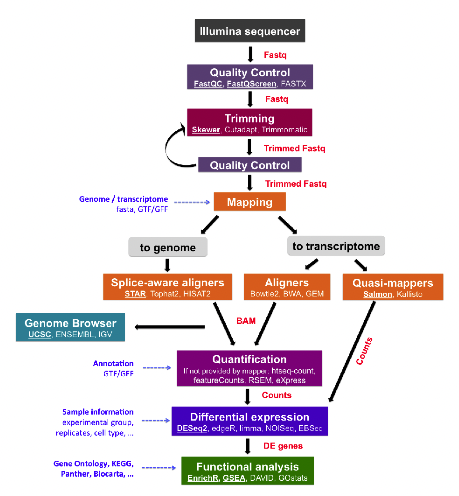
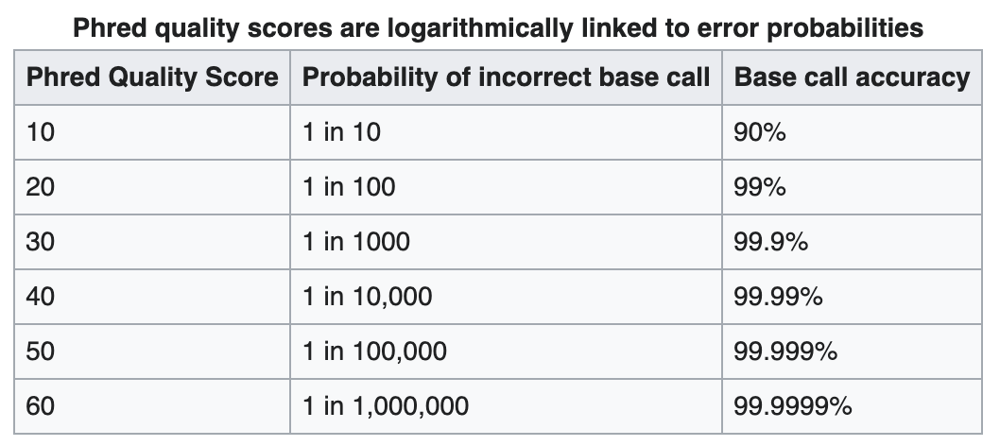
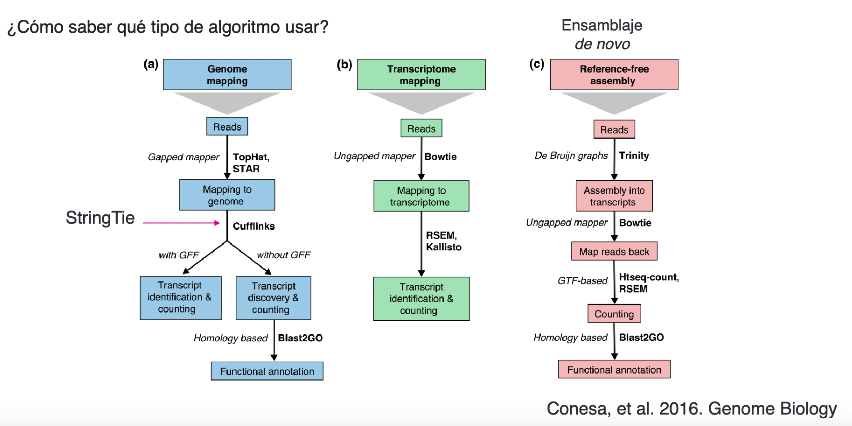
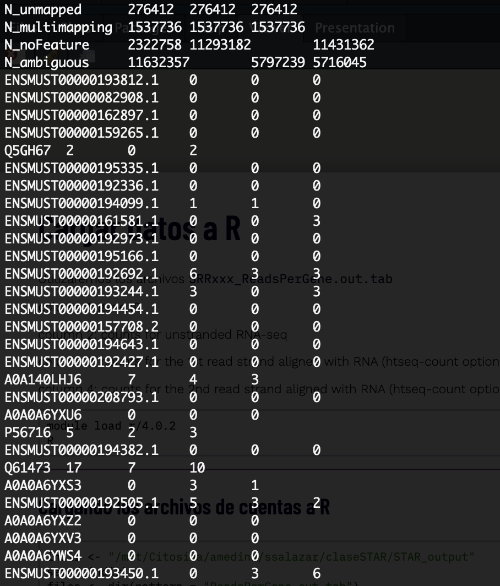

```{r setup, include = FALSE}
# Setup chunk
# Paquetes a usar
#options(htmltools.dir.version = FALSE) cambia la forma de incluir código, los colores

library(knitr)
library(tidyverse)
library(xaringanExtra)
library(icons)
library(fontawesome)
library(emo)

# set default options
opts_chunk$set(collapse = TRUE,
               dpi = 300,
               warning = FALSE,
               error = FALSE,
               comment = "#")

top_icon = function(x) {
  icons::icon_style(
    icons::fontawesome(x),
    position = "fixed", top = 10, right = 10
  )
}

knit_engines$set("yaml", "markdown")

# Con la tecla "O" permite ver todas las diapositivas
xaringanExtra::use_tile_view()
# Agrega el boton de copiar los códigos de los chunks
xaringanExtra::use_clipboard()

# Crea paneles impresionantes 
xaringanExtra::use_panelset()

# Para compartir e incrustar en otro sitio web
xaringanExtra::use_share_again()
xaringanExtra::style_share_again(
  share_buttons = c("twitter", "linkedin")
)

# Funcionalidades de los chunks, pone un triangulito junto a la línea que se señala
xaringanExtra::use_extra_styles(
  hover_code_line = TRUE,         #<<
  mute_unhighlighted_code = TRUE  #<<
)

# Agregar web cam
xaringanExtra::use_webcam()
```

```{r xaringan-editable, echo=FALSE}
# Para tener opciones para hacer editable algun chunk
xaringanExtra::use_editable(expires = 1)
# Para hacer que aparezca el lápiz y goma
xaringanExtra::use_scribble()
```

```{r xaringan-themer Eve, include=FALSE, warning=FALSE}
# Establecer colores para el tema
library(xaringanthemer)
#style_xaringan(
style_duo_accent(
  background_color = "#FFFFFF", # color del fondo
  link_color = "#562457", # color de los links
  text_bold_color = "#0072CE",
  primary_color = "#01002B", # Color 1
  secondary_color = "#CB6CE6", # Color 2
  inverse_background_color = "#00B7FF", # Color de fondo secundario 
  
  # Tipos de letra
  header_font_google = google_font("Barlow Condensed", "600"), #titulo
  text_font_google   = google_font("Work Sans", "300", "300i"), #texto
  code_font_google   = google_font("IBM Plex Mono") #codigo
)

# https://www.rdocumentation.org/packages/xaringanthemer/versions/0.3.4/topics/style_duo_accent
```

class: title-slide, middle, center
background-image: url(figures/Slide1.png) 
background-position: 90% 75%, 75% 75%, center
background-size: 1210px,210px, cover


.center-column[
# `r rmarkdown::metadata$title`
### `r rmarkdown::metadata$subtitle`

####`r rmarkdown::metadata$author` 
#### `r rmarkdown::metadata$date`
]

.left[.footnote[R-Ladies Theme[R-Ladies Theme](https://www.apreshill.com/project/rladies-xaringan/)]]

---
background-image: url(figures/liigh_unam_logo.png) 
background-position: 10% 10%
background-size: 10%
class: middle, center


# Sobre mi
----
.left-col[ 
### `r fontawesome::fa("dna", fill = "#181818")` Sofía Salazar Magaña

Estudiante de la [Licenciatura en Ciencias Genómicas](https://www.enesjuriquilla.unam.mx/?page_id=2136) @ ENES-J UNAM

Asistente de investigación @ [RegGenoLab](https://liigh.unam.mx/), LIIGH UNAM

Asistente de investigación @ [Im Lab](https://hakyimlab.org/), The University of Chicago 


[`r fontawesome::fa("github")` GitHub: SophSM](https://github.com/SophSM)
]

.center-col[
### `r fontawesome::fa("star", fill = "#181818")` Miembro

- [LupusRGMX](https://twitter.com/LupusRgmx)

- [Proyecto JAGUAR](https://twitter.com/PJaguarLATAM)
]

.right-col[


]
---

class: inverse, center, middle

`r fontawesome::fa("laptop-file", height = "3em")`
# Overview de una pipeline para analisis de RNA-seq

---

## Pipeline bioinformática para RNA-seq


.left-col["https://biocorecrg.github.io/RNAseq_course_2019/workflow.html"]

.center-col[

]

---

class: inverse, center, middle

`r fontawesome::fa("laptop-file", height = "3em")`
# Contenido de la clase

---

### 1. Descarga de datos públicos de RNA-seq con `wget`

### 2. Análisis de control de calidad de lecturas

### 3. Trimming

### 4. Alineamiento con STAR

### 5. Cargar datos a R

---

class: inverse, center, middle

`r fontawesome::fa("laptop-file", height = "3em")`
# 1. Descarga de datos públicos de RNA-seq

---

# ¿Qué datos vamos a utilizar?

### Los archivos `fastq`. 

Este es un formato de archivo que va contener:

- La sequencia de, en este caso, RNA que se sequenció

- La calidad (Q) del "llamado" de cada una de las bases nitrogenadas **(Phred Score)**, codificada en ASCII.

$$Q = -10log_{10} P $$ donde $P$ es la probabilidad de que la base sea incorrecta

.center[
]
---

# ¿Qué datos vamos a utilizar?

### Los archivos `fastq`. 

Los archivos `fastq` se van a ver algo parecido así:

```
@SEQ_ID
GATTTGGGGTTCAAAGCAGTATCGATCAAATAGTAAATCCATTTGTTCAACTCACAGTTT
+
!''*((((***+))%%%++)(%%%%).1***-+*''))**55CCF>>>>>>CCCCCCC65
``` 

---
### ¿Cómo podemos conseguir datos públicos de RNA-seq?

La forma más simple es ir a repositorios de datos públicos, como [GEO (Gene Expression Omnibus)](https://www.ncbi.nlm.nih.gov/geo/), en donde encontraremos los archivos de datos **crudos** y a veces también las matrices de cuentas ya procesadas** ó a [Recount3](https://rna.recount.bio/) (aquí podemos encontrar datos ya procesados).

**Para esta clase, usaremos las muestras del estudio [GSE155516](https://www.ncbi.nlm.nih.gov/geo/query/acc.cgi?acc=GSM4705616)**

### Descarga de los datos con `wget`

Una vez que seleccionamos el estudio que vamos a usar, entramos a la página de [ebi](https://www.ebi.ac.uk/). En el buscador, tecleamos el ID del estudio.

Seleccionamos el estudio donde dice **Nucleotide sequences**, y en la tabla inferior, en la columna **Generated FASTQ files:FTP**, seleccionamos las muestras que queremos y damos click izquierdo en donde dice **Get download script**. 

---
### Descarga de los datos con `wget`

Esto descargará un script the bash `.sh` que podremos utilizar para descargar las muestras.

Para correr este script y descargar las muestras, debemos ir a la carpeta donde las queremos guardar y ahí guardamos el script. Supongamos que yo renombré mi script a `download.sh`. Y lo tengo en una carpeta llamada `data`.


```{bash, eval = F}
cd /mnt/Citosina/amedina/ssalazar/claseSTAR/data/
chmod +x downloads.sh
./downloads.sh
```

Para correr el script, primero me doy permisos de ejecución con `chmod +x` y después ejecuto el script con `./`

---

class: inverse, center, middle

`r fontawesome::fa("laptop-file", height = "3em")`
# 2. Análisis de control de calidad

---
# 1. Análisis de control de calidad de lecturas

Para hacer análisis de control de calidad **QC**. Utilizaremos los programas `fastqc` y `multiqc`

### 1. Fastqc 

Este programa va a realizar un análisis de control de calidad en cada una de los archivos `.fastq.gz` y nos va a dar un reporte en forma de un archivo tipo `.html`.

### 2. Multiqc

Este programa toma todos los archivos `.html` que arrojó `fastqc` y nos dará un reporte combinado de todas las muestras.

---

### Correr `fastqc`

En mi caso, debo de cargar el módulo de `fastqc` primero para poder utilizar los comandos. Si estás trabajando en tu computadora local y ya está descargado `fastqc`, tal vez esto no sea necesario.

También creamos una carpeta para los outputs de `fastqc`

```{bash, eval = F}
module load fastqc/0.11.3
module load multiqc/1.5
cd /mnt/Citosina/amedina/ssalazar/claseSTAR/
mkdir quality1
```

Después, usaremos un `for loop` para hacer `fastqc` a todos los archivos que tengan terminación `.fastq.gz`

```{bash, eval = F}
for file in data/*.fastq.gz; do fastqc $file -o quality1; done
```

El comando para correr `fastqc` en un solo archivo es:

```{bash, eval = F}
fastqc nombre.fastq.gz -o /directorio/de/salida
```

---
### Pausa: Mi carpeta se ve (más o menos) así:
```{bash, eval = F}
claseSTAR
├── data
│   ├── downloads.sh
│   ├── SRR12363092_1.fastq.gz
│   ├── SRR12363092_2.fastq.gz
│   ├── SRR12363093_1.fastq.gz
│   ├── SRR12363093_2.fastq.gz
...
├── quality1
│   ├── SRR12363092_1_fastqc.html
│   ├── SRR12363092_1_fastqc.zip
│   ├── SRR12363092_2_fastqc.html
...
```
---
### Correr `multiqc`

Multiqc reconoce los outputs de `fastqc` por lo que el comando para utilizarlo es muy sencillo

```{bash, eval = F}
multiqc quality1
```

#### **NOTA: siempre es mejor utlizar direcciones absolutas a relativas, para evitar que tus outputs se guarden en un directorio no deseado: **

```{bash, eval = F}
multiqc /mnt/Citosina/amedina/ssalazar/claseSTAR/quality1
```

---
### Analicemos el output de `multiqc`

```
multiqc_report.html
```

---

class: inverse, center, middle

`r fontawesome::fa("laptop-file", height = "3em")`
# 3. Trimming

---

## Trimming

Para hacer trimming de las lecturas que no tuvieron una buena calidad, utilizaremos la herramienta `trimmomatic`. Este programa tiene muchas opciones que nos permiten hacer trimming de formas distintas, aquí muestro el comando que utilizaremos para nuestras necesidades. Pero asegúrate de leer el [manual](http://www.usadellab.org/cms/uploads/supplementary/Trimmomatic/TrimmomaticManual_V0.32.pdf) para tus análisis personales.


**Para paired end necesitamos:**

- Las dos lecturas paired end por muestra: `SRRxxxxx_1.fastq.gz` y `SRRxxxx_2.fastq.gz`

- Un archivo con los adaptadores que vamos a cortar: `TruSeq3-PE-2.fa`

Descarga los adaptadores de [aquí](https://github.com/timflutre/trimmomatic/blob/master/adapters/TruSeq3-PE-2.fa)

```{bash, eval = F}
wget https://raw.githubusercontent.com/timflutre/trimmomatic/master/adapters/TruSeq3-PE-2.fa
```


Trimmomatic nos dará 4 outputs: Las secuencias que quedaron sin par que eran originalmente del archivo "1": `_1_unpaired.fastq.gz`, las secuencias sin par que eran del archivo "2": `_2_unpaired.fastq.gz` y las secuencias que aun están pareadas: `_1_trimmed.fastq.gz` y `_2_trimmed.fastq.gz`
---

## Correr Trimmomatic

Creamos una carpeta para los resultados

```{bash, eval = F}
mkdir /mnt/Citosina/amedina/ssalazar/claseSTAR/TRIM_results
```

Usamos un `for loop` para hacer trimmomatic a cada par de lecturas `SRRxxxxx_1.fastq.gz` y `SRRxxxx_2.fastq.gz`

```{bash, eval = F}
module load trimmomatic/0.33
cd /mnt/Citosina/amedina/ssalazar/claseSTAR/data
for i in *_1.fastq.gz;
do echo
trimmomatic PE -threads 8 -phred33 $i "${i%_1.fastq.gz}_2.fastq.gz" \
/mnt/Citosina/amedina/ssalazar/claseSTAR/TRIM_results/"${i%_1.fastq.gz}_1_trimmed.fq.gz" \
/mnt/Citosina/amedina/ssalazar/claseSTAR/TRIM_results/"${i%_1.fastq.gz}_1_unpaired.fq.gz" \
/mnt/Citosina/amedina/ssalazar/claseSTAR/TRIM_results/"${i%_1.fastq.gz}_2_trimmed.fq.gz" \
/mnt/Citosina/amedina/ssalazar/claseSTAR/TRIM_results/"${i%_1.fastq.gz}_2_unpaired.fq.gz" \
ILLUMINACLIP:/mnt/Citosina/amedina/ssalazar/claseSTAR/TruSeq3-PE-2.fa:2:30:10 LEADING:3 TRAILING:3 SLIDINGWINDOW:4:20 MINLEN:80 \

done
```

---

# Documentación de las opciones

`ILLUMINACLIP:<fastaWithAdaptersEtc>:<seed mismatches>:<palindrome clip threshold>:<simple clip threshold>`

- seedMismatches: specifies the maximum mismatch count which will still allow a full match to be performed

- palindromeClipThreshold: specifies how accurate the match between the two 'adapter ligated' reads must be for PE palindrome read alignment.

- simpleClipThreshold: specifies how accurate the match between any adapter sequence must be against a read.


`SLIDINGWINDOW:<windowSize>:<requiredQuality>`

- windowSize: specifies the number of bases to average across

- requiredQuality: specifies the average quality required.

```{bash, eval= F}
ILLUMINACLIP:/mnt/Citosina/amedina/ssalazar/claseSTAR/TruSeq3-PE-2.fa:2:30:10 LEADING:3 TRAILING:3 SLIDINGWINDOW:4:20 MINLEN:80
```

---

`LEADING:<quality>`

Remove low quality bases from the beginning

quality: Specifies the minimum quality required to keep a base.

`TRAILING:<quality>`

Remove low quality bases from the end.

quality: Specifies the minimum quality required to keep a base

```{bash, eval= F}
ILLUMINACLIP:/mnt/Citosina/amedina/ssalazar/claseSTAR/TruSeq3-PE-2.fa:2:30:10 LEADING:3 TRAILING:3 SLIDINGWINDOW:4:20 MINLEN:80
```

---

## QC del Trimming

### ¿Qué tan bueno fue nuestro control de calidad?

Corramos `fastqc` y `multiqc` de nuevo

```{bash, eval = F}
mkdir /mnt/Citosina/amedina/ssalazar/claseSTAR/quality2
for file in /mnt/Citosina/amedina/ssalazar/claseSTAR/TRIM_results/*.fq.gz; do fastqc $file -o /mnt/Citosina/amedina/ssalazar/claseSTAR/quality2; done
```

```{bash, eval = F}
multiqc /mnt/Citosina/amedina/ssalazar/claseSTAR/quality2
```

---
### Pausa: Mi carpeta se ve (más o menos) así:
```{bash, eval = F}
claseSTAR
├── data
│   ├── downloads.sh
│   ├── SRR12363092_1.fastq.gz
...
├── quality1
│   ├── multiqc_data
│   │   ├── multiqc_data.json
│   │   ...
│   ├── multiqc_report.html
...
├── quality2
│   ├── multiqc_data
│   │   ...
│   ├── SRR12363092_1_trimmed.fq_fastqc.html
│   ├── SRR12363092_1_unpaired.fq_fastqc.html
│   ├── SRR12363092_2_trimmed.fq_fastqc.html
...
├── TRIM_results
│   ├── SRR12363092_1_trimmed.fq.gz
│   ├── SRR12363092_1_unpaired.fq.gz
```
---

### Analicemos el output de `multiqc`

```
multiqc_report.html
```
---

class: inverse, center, middle

`r fontawesome::fa("laptop-file", height = "3em")`
# 4. Alineamiento con STAR

---
# Pero antes: ¿Qué es el alineamiento?

La alineación del genoma es un proceso bioinformático que consiste alinear las secuencias de ADN o ARN de uno o más genomas. El objetivo principal de la alineación del genoma es identificar regiones de similitud u homología entre las secuencias, lo que puede proporcionar información valiosa sobre diversos procesos biológicos, como la identificación de genes, el análisis evolutivo y la anotación funcional.


---

## Existen Diversas formas de alinear en RNA-seq



https://github.com/EveliaCoss/RNAseq_classFEB2023

---

#### **1. Alineación a genoma de referencia:**

La alineación del genoma de referencia implica mapear las lecturas de RNA-Seq en un **genoma de referencia** conocido.

- Nos permite identificar y cuantificar la expresión de **genes conocidos** y sus isoformas Y podemos anotar nuevos transcritos.

- Podemos utilizar un archivo de anotación (GFF)

#### **2. Alineación a transcriptoma:**

Las lecturas de RNA-Seq se asignan a un transcriptoma de referencia, que es una colección de transcritos. 

- Veremos expresión de genes, pero no isoformas

- No hay anotación de nuevos transcritos

- Si no está en el archivo de anotación no lo veremos

#### **3. Ensamblaje de novo**

Ideal para una especie con genoma de mala calidad o sin referencia, como organismos no modelos, además de si no contamos con un archivo de anotación bueno

Es recomendado utilizar lecturas Paired End

---

## ¿Qué es un archivo de anotación?

- Un archivo de anotación GFF (General Feature File) es un formato de archivo estándar utilizado en bioinformática para almacenar y representar información genómica y de anotación para diversas características dentro de un genoma, como genes, transcritos, exones y otros elementos genómicos.

**Utilizamos estos archivos junto al genoma de referencia para poder encontrar ubicaciones de genes, transcritos etc**

- Los archivos GFF pueden venir en diferentes versiones, siendo GFF3 uno de los formatos más utilizados.

Podemos encontrar estos archivos en bases de datos genómicas como GENCODE para humanos y ratones [aquí](www.gencodegenes.org)
---

# En esta clase utilizaremos el software de alineamiento **STAR**, de tipo alineamiento a genoma de referencia

#### Seguiremos 2 sencillos pasos

1. Indexar el genoma de referencia creando un índice de STAR

2. Alinear y contar con STAR

[Manual de STAR](https://github.com/alexdobin/STAR/blob/master/doc/STARmanual.pdf)
---

## ¿Qué es indexar un genoma de referencia

Es una forma computacional de crear una "estructura de datos" para el genoma de referencia, mediante **índices**, de tal forma que podramos accesar a las partes del mismo de una forma más eficiente al alinear. 
El genoma de referencia sirve como plantilla contra la cual se realizan diversos análisis genómicos, como mapeo de lecturas, llamado de variantes y cuantificación de la expresión génica. **La indexación mejora la velocidad y la eficiencia de estos análisis** al permitir que el software **ubique y acceda rápidamente** a partes relevantes del genoma.

---

## 1. Crear un índice de STAR

Carguemos el módulo de STAR

```{bash, eval = F}
module load star/2.7.9a
```

Creamos un directorio para guardar el indice

```{bash, eval = F}
mkdir /mnt/Citosina/amedina/ssalazar/claseSTAR/STAR_index
```

El script para crear el indice es el siguiente:

```{bash, eval = F}
STAR --runThreadN 12 \
--runMode genomeGenerate \
--genomeDir /mnt/Citosina/amedina/ssalazar/claseSTAR/STAR_index \
--genomeFastaFiles /mnt/Archives/genome/mouse/mm10/UCSC/chromosomes-1-file/mm10.fa \
--sjdbGTFfile /mnt/Citosina/amedina/ssalazar/claseSTAR/annotation/mm10.knownGene.gtf.gz \
--sjdbOverhang 149
```

Entremos al 
[Manual de STAR](https://github.com/alexdobin/STAR/blob/master/doc/STARmanual.pdf) para entender las opciones

--- 

## 2. Alinear con STAR

```{bash, eval = F}
index=/mnt/Citosina/amedina/ssalazar/claseSTAR/STAR_index
FILES=/mnt/Citosina/amedina/ssalazar/claseSTAR/TRIM_results/*_1_trimmed.fq.gz
for f in $FILES
do
    base=$(basename $f _1_trimmed.fq.gz)
    echo $base
    STAR --runThreadN 12 --genomeDir $index --readFilesIn $f /mnt/Citosina/amedina/ssalazar/claseSTAR/TRIM_results/$base"_2_trimmed.fq.gz" --outSAMtype BAM SortedByCoordinate \
    --quantMode GeneCounts --readFilesCommand zcat --outFileNamePrefix /mnt/Citosina/amedina/ssalazar/claseSTAR/STAR_output/$base
done
```

---

class: inverse, center, middle

`r fontawesome::fa("laptop-file", height = "3em")`
# 5. Cargar datos a R

---

# Cargar datos a R

Utilizaremos los archivos `SRRxxx_ReadsPerGene.out.tab`

```{bash, eval = F}
cd /mnt/Citosina/amedina/ssalazar/claseSTAR/STAR_output
less SRR12363102_ReadsPerGene.out.tab
```



---

## Información de los archivos `.out.tab`

**column 1:** gene ID

**column 2:** counts for unstranded RNA-seq

**column 3:** counts for the 1st read strand aligned with RNA (htseq-count option -s yes)

**column 4:** counts for the 2nd read strand aligned with RNA (htseq-count option -s reverse)

---

```{bash, eval = F}
module load r/4.0.2
R
```


## Cargando los archivos de cuentas a R

**Las siguientes lineas de commandos, están en lenguaje de R**

```{r, eval = F}
indir <- "/mnt/Citosina/amedina/ssalazar/claseSTAR/STAR_output"
setwd(indir)
files <- dir(pattern = "ReadsPerGene.out.tab")
```

Exploremos los datos

```{r, eval = F}
files
# [1] "SRR12363092_ReadsPerGene.out.tab" "SRR12363093_ReadsPerGene.out.tab"
# [3] "SRR12363095_ReadsPerGene.out.tab" "SRR12363096_ReadsPerGene.out.tab"
# [5] "SRR12363098_ReadsPerGene.out.tab" "SRR12363099_ReadsPerGene.out.tab"
# [7] "SRR12363101_ReadsPerGene.out.tab" "SRR12363102_ReadsPerGene.out.tab"
```

---

## Creamos una matriz para las cuentas

Esta matriz tendrá como filas a los genes, y como columnas a las muestras.

```{r, eval = F}
seq_along(files)
# [1] 1 2 3 4 5 6 7 8
```

### Leer cada tabla de cuentas y extraer la segunda columna

```{r, eval = F}
counts <- c() # esta sera la matriz
for(i in seq_along(files)){
  x <- read.table(file = files[i], sep = "\t", header = F, as.is = T)
  # as.is para no convertir tipo de datos
  counts <- cbind(counts, x[,2])
}
```

---

### Exploremos datos

```{r, eval = F}
head(counts, 2)
#         [,1]     [,2]     [,3]     [,4]     [,5]     [,6]     [,7]     [,8]
# [1,]   342365   426305   353223   283129   346810   374542   256990   276412
# [2,]  1101670  1231975  1232813   992671  1326029  1317793  1317426  1537736
```

```{r, eval = F}
dim(counts)
# [1] 129239      4
```

---

### Cargamos metadatos

```{r, eval = F}
metadata <- read.csv("/mnt/Citosina/amedina/ssalazar/claseSTAR/metadata.csv", header = F)
colnames(metadata) <- c("sample_id", "type")
head(metadata, 2)
#     sample_id    type
# 1 SRR12363092 CONTROL
# 2 SRR12363093 CONTROL
```

### Creamos dataframe

```{r, eval = F}
counts <- as.data.frame(counts)
```

### Asignamos los nombres de las filas

```{r, eval = F}
rownames(counts) <- x[,1] # x es el archivo original, no importa cual sea, tiene las mismas anotaciones
```

---

### Asignamos los nombres de las columnas

```{r, eval = F}
colnames(counts) <- sub("_ReadsPerGene.out.tab", "", files)
```


```{r, eval = F}
head(counts, 2)

#                SRR12363092 SRR12363093 SRR12363095 SRR12363096 SRR12363098
# N_unmapped          342365      426305      353223      283129      346810
# N_multimapping     1101670     1231975     1232813      992671     1326029
#                SRR12363099 SRR12363101 SRR12363102
# N_unmapped          374542      256990      276412
# N_multimapping     1317793     1317426     1537736
```


### Guardamos

```{r, eval = F}
save(counts, file = "/mnt/Citosina/amedina/ssalazar/claseSTAR/counts/raw_counts.RData")
write.csv(counts, file = "/mnt/Citosina/amedina/ssalazar/claseSTAR/counts/raw_counts.csv")
```

---
### SCRIPTS DE LA CLASE

Todos los scripts usados en esta clase están en el [GitHub](https://github.com/EveliaCoss/RNASeq_Workshop_Nov2023/tree/main/Dia2_Alineamiento/scripts)

