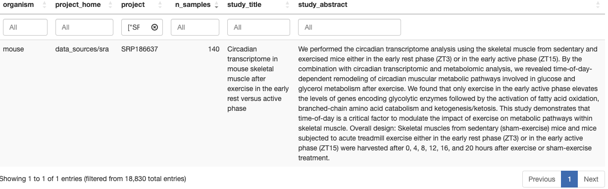

```{r setup, include = FALSE}
# Setup chunk
# Paquetes a usar
#options(htmltools.dir.version = FALSE) cambia la forma de incluir código, los colores

library(knitr)
library(tidyverse)
library(xaringanExtra)
library(icons)
library(fontawesome)
library(emo)

# set default options
opts_chunk$set(collapse = TRUE,
               dpi = 300,
               warning = FALSE,
               error = FALSE,
               comment = "#")

top_icon = function(x) {
  icons::icon_style(
    icons::fontawesome(x),
    position = "fixed", top = 10, right = 10
  )
}

knit_engines$set("yaml", "markdown")

# Con la tecla "O" permite ver todas las diapositivas
xaringanExtra::use_tile_view()
# Agrega el boton de copiar los códigos de los chunks
xaringanExtra::use_clipboard()

# Crea paneles impresionantes 
xaringanExtra::use_panelset()

# Para compartir e incrustar en otro sitio web
xaringanExtra::use_share_again()
xaringanExtra::style_share_again(
  share_buttons = c("twitter", "linkedin")
)

# Funcionalidades de los chunks, pone un triangulito junto a la línea que se señala
xaringanExtra::use_extra_styles(
  hover_code_line = TRUE,         #<<
  mute_unhighlighted_code = TRUE  #<<
)

# Agregar web cam
xaringanExtra::use_webcam()
```

```{r xaringan-editable, echo=FALSE}
# Para tener opciones para hacer editable algun chunk
xaringanExtra::use_editable(expires = 1)
# Para hacer que aparezca el lápiz y goma
xaringanExtra::use_scribble()
```

```{r xaringan-themer Eve, include=FALSE, warning=FALSE}
# Establecer colores para el tema
library(xaringanthemer)
#style_xaringan(
style_duo_accent(
  background_color = "#FFFFFF", # color del fondo
  link_color = "#562457", # color de los links
  text_bold_color = "#0072CE",
  primary_color = "#01002B", # Color 1
  secondary_color = "#CB6CE6", # Color 2
  inverse_background_color = "#00B7FF", # Color de fondo secundario 
  
  # Tipos de letra
  header_font_google = google_font("Barlow Condensed", "600"), #titulo
  text_font_google   = google_font("Work Sans", "300", "300i"), #texto
  code_font_google   = google_font("IBM Plex Mono") #codigo
)

# https://www.rdocumentation.org/packages/xaringanthemer/versions/0.3.4/topics/style_duo_accent
```

class: title-slide, middle, center
background-image: url(figures/Slide1.png) 
background-position: 90% 75%, 75% 75%, center
background-size: 1210px,210px, cover


.center-column[
# `r rmarkdown::metadata$title`
### `r rmarkdown::metadata$subtitle`

####`r rmarkdown::metadata$author` 
#### `r rmarkdown::metadata$date`
]

.left[.footnote[R-Ladies Theme[R-Ladies Theme](https://www.apreshill.com/project/rladies-xaringan/)]]

---
background-image: url(figures/liigh_unam_logo.png) 
background-position: 10% 10%
background-size: 10%
class: middle, center


# Sobre mi
----
.left-col[ 
### `r fontawesome::fa("dna", fill = "#181818")` Sofía Salazar Magaña

Estudiante de la [Licenciatura en Ciencias Genómicas](https://www.enesjuriquilla.unam.mx/?page_id=2136) @ ENES-J UNAM

Asistente de investigación @ [RegGenoLab](https://liigh.unam.mx/), LIIGH UNAM

Asistente de investigación @ [Im Lab](https://hakyimlab.org/), The University of Chicago 


[`r fontawesome::fa("github")` GitHub: SophSM](https://github.com/SophSM)
]

.center-col[
### `r fontawesome::fa("star", fill = "#181818")` Miembro

- [LupusRGMX](https://twitter.com/LupusRgmx)

- [Proyecto JAGUAR](https://twitter.com/PJaguarLATAM)
]

.right-col[


]

---

class: inverse, center, middle

`r fontawesome::fa("laptop-file", height = "3em")`
# Contenido de la clase

---

### 1. Importar nuestros alineamientos de STAR a R

### 2. Creación de matriz de cuentas

### 3. Importar datos de otras fuentes (Recount3)

---

class: inverse, center, middle

`r fontawesome::fa("laptop-file", height = "3em")`
# 1. Importar nuestros alineamientos de STAR a R

---

# Cargar datos a R

Utilizaremos los archivos `SRRxxx_ReadsPerGene.out.tab`

```{bash, eval = F}
cd /mnt/Citosina/amedina/ssalazar/claseSTAR/STAR_output
less SRR12363102_ReadsPerGene.out.tab
```


---

## Información de los archivos `.out.tab`

**column 1:** gene ID

**column 2:** counts for unstranded RNA-seq

**column 3:** counts for the 1st read strand aligned with RNA (htseq-count option -s yes)

**column 4:** counts for the 2nd read strand aligned with RNA (htseq-count option -s reverse)

---

```{bash, eval = F}
module load r/4.0.2
R
```


## Cargando los archivos de cuentas a R

**Las siguientes lineas de commandos, están en lenguaje de R**

```{r, eval = F}
indir <- "/mnt/Citosina/amedina/ssalazar/claseSTAR/STAR_output"
setwd(indir)
files <- dir(pattern = "ReadsPerGene.out.tab")
```

Exploremos los datos

```{r, eval = F}
files
# [1] "SRR12363092_ReadsPerGene.out.tab" "SRR12363093_ReadsPerGene.out.tab"
# [3] "SRR12363095_ReadsPerGene.out.tab" "SRR12363096_ReadsPerGene.out.tab"
# [5] "SRR12363098_ReadsPerGene.out.tab" "SRR12363099_ReadsPerGene.out.tab"
# [7] "SRR12363101_ReadsPerGene.out.tab" "SRR12363102_ReadsPerGene.out.tab"
```

---

class: inverse, center, middle

`r fontawesome::fa("laptop-file", height = "3em")`
# 2. Creación de matriz de cuentas


---

## Creamos una matriz para las cuentas

Esta matriz tendrá como filas a los genes, y como columnas a las muestras.

```{r, eval = F}
seq_along(files)
# [1] 1 2 3 4 5 6 7 8
```

### Leer cada tabla de cuentas y extraer la segunda columna

```{r, eval = F}
counts <- c() # esta sera la matriz
for(i in seq_along(files)){
  x <- read.table(file = files[i], sep = "\t", header = F, as.is = T)
  # as.is para no convertir tipo de datos
  counts <- cbind(counts, x[,2])
}
```

---

### Exploremos datos

```{r, eval = F}
head(counts, 2)
#         [,1]     [,2]     [,3]     [,4]     [,5]     [,6]     [,7]     [,8]
# [1,]   342365   426305   353223   283129   346810   374542   256990   276412
# [2,]  1101670  1231975  1232813   992671  1326029  1317793  1317426  1537736
```

```{r, eval = F}
dim(counts)
# [1] 129239      4
```

---

### Cargamos metadatos

**¿Qué son los metadatos?**

Los metadatos nos van a dar la información acerca de las columnas / muestras de nuestros datos. Una tabla de metadatos puede tener, además de los nombres de las muestras, información clínica, por ejemplo, tratamiento, peso, tipo de alimentación, enfermedad (sí o no), etc.

Estos datos son útiles para análisis posteriores, en los que queremos relacionar expresión diferencial con una condición o condiciones.

Para esta clase, solo tenemos metadatos sobre el tipo de muestra (CONTROL, PLS_30min, PLS_15min & PLS_4h).

https://www.nature.com/articles/s41380-020-00955-5

Encuentra los metadatos [aquí](https://github.com/EveliaCoss/RNASeq_Workshop_Nov2023/blob/main/Dia3_workflowR/data/metadata.csv)

```{r, eval = F}
metadata <- read.csv("/mnt/Citosina/amedina/ssalazar/claseSTAR/metadata.csv", header = F)
colnames(metadata) <- c("sample_id", "type")
head(metadata, 2)
#     sample_id    type
# 1 SRR12363092 CONTROL
# 2 SRR12363093 CONTROL
```

---

### Creamos dataframe

```{r, eval = F}
counts <- as.data.frame(counts)
```

### Asignamos los nombres de las filas

```{r, eval = F}
rownames(counts) <- x[,1] # x es el archivo original, no importa cual sea, tiene las mismas anotaciones
```

```{r, eval = F}
# for(i in seq_along(files)){
  # x <- read.table(file = files[i], sep = "\t", header = F, as.is = T)
  # counts <- cbind(counts, x[,2])
# }
```

---

### Asignamos los nombres de las columnas

```{r, eval = F}
colnames(counts) <- sub("_ReadsPerGene.out.tab", "", files)
```


```{r, eval = F}
head(counts, 2)

#                SRR12363092 SRR12363093 SRR12363095 SRR12363096 SRR12363098
# N_unmapped          342365      426305      353223      283129      346810
# N_multimapping     1101670     1231975     1232813      992671     1326029
#                SRR12363099 SRR12363101 SRR12363102
# N_unmapped          374542      256990      276412
# N_multimapping     1317793     1317426     1537736
```


### Guardamos

```{r, eval = F}
save(counts, file = "/mnt/Citosina/amedina/ssalazar/claseSTAR/counts/raw_counts.RData")
write.csv(counts, file = "/mnt/Citosina/amedina/ssalazar/claseSTAR/counts/raw_counts.csv")
```

---

## Descarga la matriz de cuentas 

- En formato .csv [aquí](https://github.com/EveliaCoss/RNASeq_Workshop_Nov2023/blob/main/Dia3_workflowR/data/raw_counts.csv)

- En formato .RData [aquí](https://github.com/EveliaCoss/RNASeq_Workshop_Nov2023/blob/main/Dia3_workflowR/data/raw_counts.RData)

El script de R que utilicé para obtener la matriz de cuentas [aquí](https://github.com/EveliaCoss/RNASeq_Workshop_Nov2023/blob/main/Dia3_workflowR/scripts/load_data_inR.R)

---
class: inverse, center, middle

`r fontawesome::fa("laptop-file", height = "3em")`
# 3. Importar datos de otras fuentes (Recount3)

---

## 

Recurso muy útil para descargar datos procesados de RNA-seq. Especialmente, es muy útil si contamos con recursos computacionales limitados.

### **Características de Recount3** 

- Datos **públicos** procesados con la misma pipeline (monorail).

- Contiene cuentas de genes, exones y exon-exon junction, así como archivos de cobertura BigWig.

- Con un total de 8679 estudios de humano y 10088 de ratón. 

- Además, cuenta con un paquete de R/Bioconductor, que nos perimeta además accesar a los metadatos de los estudios.

- Tiene una interfaz gráfica para explorar los estudios disponibles [aquí](https://jhubiostatistics.shinyapps.io/recount3-study-explorer/), la documentación está [aquí](https://rna.recount.bio/docs/)

**Entremos al explorador de estudios**

---

###  Como ejemplo para esta clase, trabajaremos con el estudio SRP186637



### Para descargar datos de recount3 en R, necesitaremos instalar el paquete de recount3

```{r, message=FALSE}
if (!requireNamespace("BiocManager", quietly = TRUE))
    install.packages("BiocManager")
BiocManager::install("recount3")
```

---

### Cargamos la librería

```{r, message = F}
library("recount3")
```

### Encontremos el estudio que nos interesa


```{r}
mouse_projects <- available_projects(organism = "mouse")
proj_info <- subset(
    mouse_projects,
    project == "SRP186637" & project_type == "data_sources"
)
```

Si aparece un mensaje como el siguiente, solo escribe "yes" y enter

```
/Users/sofiasalazar/Library/Caches/org.R-project.R/R/recount3
  does not exist, create directory? (yes/no)
```

---

## Ahora, debemos crear un objeto de tipo **RangedSummarizedExperiment (RSE)**

Este es un tipo de objeto de R, que además de contener las cuentas por muestra, contiene los metadatos y también información sobre el alineamiento de cada muestra. **Es una tabla con más tablas**

```{r}
rse_gene <- create_rse(proj_info)
```

---

### **Exploremos los datos**

```{r}
rse_gene
```

- `dim` nos dice las dimensiones, tenemos cuentas para **55421 transcritos** en **140 muestras**

```{r}
dim(rse_gene)
```

---

- `metadata` nos da información sobre el objeto

```{r}
metadata(rse_gene)
```

---

- `assays` aquí es donde están guardados los "assays", en este caso las cuentas crudas (la matriz de cuentas)

```{r}
head(assays(rse_gene)$raw_counts, 2)
```

---

- `rownames` son los nombres de los genes (filas)

```{r}
head(rownames(rse_gene), 5)
```

- `rowData` nos da información sobre los genes, es una tabla con la siguiente información para gen:

```{r}
names(rowData(rse_gene))
```

- `colnames` tiene los nombres de las muestras del estudio

```{r}
head(colnames(rse_gene), 5)
```

- `colData` tiene los metadatos de las muestras, es una tabla con la siguiente información para cada muestra

```{r}
head(names(colData(rse_gene)), 5)
```

---

Por ejemplo, los metadatos de las muestras se encuentran en "sra.sample_attributes"

```{r}
head(rse_gene$sra.sample_attributes, 5)
```

---

### **Transformar cuentas**

De acuerdo con la documentación de recount3, para hacer análisis de expresión diferencial, se deben de escalar las cuentas curdas, hay dos formas de transformar las cuentas "AUC" y "mapped_reads". 

"Tenga en cuenta que las cuentas crudas son la suma de la cobertura del nivel base, por lo que debe tener en cuenta la cobertura total del par de bases para la muestra dada."

Creamos un nuevo **assay** llamado "counts"
```{r}
assays(rse_gene)$counts <- transform_counts(rse_gene, by = "auc")
```

---

Ahora, notemos que tenemos 2 assays

```{r}
rse_gene
```
Para guardar estas cuentas en un `dataframe`

```{r}
counts_df <- as.data.frame(assays(rse_gene)$counts)
```

---

### Bonus: extraer metadatos

```{r}
head(rse_gene$sra.sample_attributes, 5)
```

Podemos crear un dataframe con esta información mejor acomodada así:

```{r}
values <- rse_gene$sra.sample_attributes
# Creamos una lista de listas de los valores separados por |
value_lists <- strsplit(values, "|", fixed = T)
# Creamos una lista para meter los valores extraidos
extracted_values <- list()
# Iteramos en value_lists y extraemos valores
for (value_list in value_lists) {
  # guardamos nuevo elemento, valores separados por ";;", segundo elemento
  extracted_values[[length(extracted_values) + 1]] <- lapply(strsplit(value_list, ";;", fixed = TRUE), function(x) x[[2]])
}
```

---

Creamos una dataframe de la lista de valores extraidos

```{r}
metadata_df <- as.data.frame(do.call(rbind, extracted_values)) # rbind combina todas las filas de las listas, do.call aplica rbind a toda la lista
# nombramos columnas
colnames(metadata_df) <- c("age", "gender", "phase", "source_name",
                           "strain", "tissue", "treatment", "zt")
metadata_df$age <- as.factor(metadata_df$age)
metadata_df$gender <- as.factor(metadata_df$gender)
metadata_df$source_name <- as.factor(metadata_df$source_name)
metadata_df$strain <- as.factor(metadata_df$strain)
metadata_df$tissue <- as.factor(metadata_df$tissue)
metadata_df$treatment <- as.factor(unlist(metadata_df$treatment))
metadata_df$zt <- as.numeric(metadata_df$zt)
metadata_df$sample <- colnames(rse_gene)# Agregamos columna con los nombres de muestras
head(metadata_df, 2)
```

