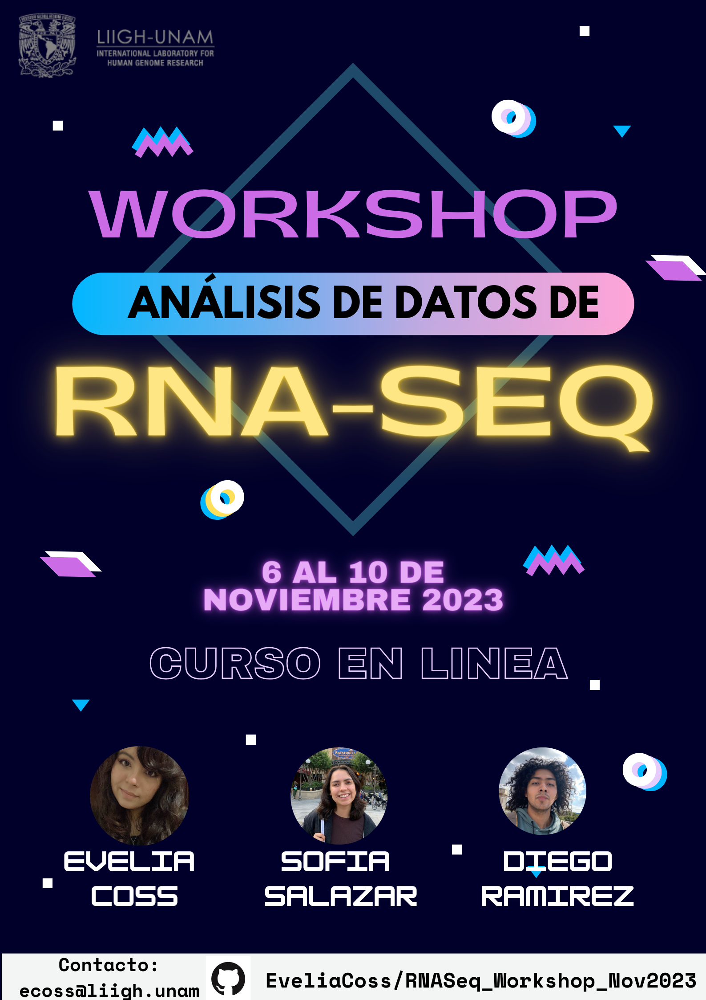

<p align="center">

</p>

# Workshop: Análisis de datos de RNA-Seq

Curso en línea por Teams

Totalmente gratuito

Las clases serán grabadas y se encontrarán almacenados en este GitHub. 

El github estará disponible en su versión final hasta el lunes 6 de noviembre.

## Información sobre horarios 💻
- Lunes 6 de nov de 1:30 pm a 3:30 pm CDMX (GMT-6)
- Martes 7 de nov de 9:00 am a 11:00 am CDMX (GMT-6)
- Miercoles 8 de nov de 9:00 am a 11:00 am CDMX (GMT-6)
- Jueves 9 de nov de 9:00 am a 11:00 am CDMX (GMT-6)
- Viernes 10 de nov de 9:00 am a 11:00 am CDMX (GMT-6)

## Inscripción

Las inscripciones comenzaran el jueves 26 de octubre y terminaran el 2 de noviembre a las 4 pm.

Da click en el siguiente link: https://forms.gle/P9FnLgfnjjommZkX9

Para cualquier duda o problema mandar un correo a la coordinadora del curso, la Dra. Evelia Coss (ecoss@liigh.unam.mx).

## Descripción

El módulo consta de sesiones teóricas y prácticas impartidas vía Teams, que cubrirán aspectos básicos del tópico como:

- Calidad y limpieza de archivos fastq
- Alineamiento y ensamblaje con el genoma de referencia usando STAR
- Generación del archivo de cuentas crudas
- Importar datos en R
- Normalización y corrección por batch
- Expresión diferencial con DESEq2 y edgeR
- Análisis funcional de los genes detectados
- Visualización grafica de los resultados

Se darán presentaciones detalladas del uso de programas clave, todos de código fuente abierto, usando datos tomados de las bases de datos. También se presentará el uso de algunos scripts de Bash y R muy sencillos, con el objetivo de aprender los aspectos básicos de estos lenguajes para el análisis de datos transcriptómico.

## Instructores 👾

- Evelia Coss, Posdoc de la Dra. Alejandra Medina, LIIGH-UNAM
- Sofia Salazar, Estudiante de Licenciatura en Ciencias Genómicas, ENES, UNAM
- Diego Ramirez, Estudiante de Licenciatura en Ciencias Genómicas, ENES, UNAM

## Contenido 📌

- Dia 1. Aspectos generales de RNA-Seq / Control de calidad de los datos - Evelia Coss
- Dia 2. Diversos pipeline para Alineamiento, ensamblaje y conteo / Importar datos en R - Sofia Salazar
- Dia 3. Trabajando con datos de RNA-seq de distintas fuentes en R
- Dia 4. Normalización y Corrección por batch / DEG con DESeq2 y edgeR - Diego Ramirez
- Dia 5. GSEA - Análisis funcional - Diego Ramirez

## Requisitos

- Contar con una terminal en tu sistema operativo
  - Si cuentas con Windows tener una terminal como [MobaXTerm](https://mobaxterm.mobatek.net/) o descargar y acceder a la terminal de [Visual Studio Code](https://code.visualstudio.com/)
  - Si cuentas con una Mac o Linux, ya tienes una terminal incluida.
- Tener conocimientos basicos del uso de R.
- Tener instalado R version 4.3.1 y RStudio
- Paquetes de R con Bioconductor
  - Bioconductor
  - DESEq2
  - tximport
  - topGO
  - biomaRT

```
# Instalar Bioconductor
if (!require("BiocManager", quietly = TRUE))
    install.packages("BiocManager")
BiocManager::install(version = "3.16")

# Paquetes / librerias
paquetes = c("DESeq2", "tximport", "topGO", "biomaRT")
BiocManager::install(paquetes)
```

- Paquetes de R (CRAN)
  - RColorBrewer (opcional)
  - tidyverse
  - dplyr
  - stringr
  - ggrepel
  - ggplot2
 
```
install.packages("tidyverse")
#install.packages("RColorBrewer")
install.packages("dplyr")
#install.packages("stringr")
install.packages("ggrepel")
install.packages("ggplot2")
```
### Dia 1. Aspectos generales de RNA-Seq / Control de calidad de los datos 
[LINK PARA REUNIÓN](https://teams.microsoft.com/l/meetup-join/19%3ameeting_MzNlNGZiNDktNWU4NC00YzQxLTk3NzMtMTUyOTYyYjFlNTMy%40thread.v2/0?context=%7b%22Tid%22%3a%225f282910-176f-459d-ab7d-b744aa6efc07%22%2c%22Oid%22%3a%2251157ae0-b0ce-4989-995e-f74bec8217e9%22%7d)

- Fecha: Lunes 6 de Noviembre 2023
- Instructora: Evelia Coss
- Presentación:
  - [Aspectos generales de RNA-Seq](https://eveliacoss.github.io/RNASeq_Workshop_Nov2023/Dia1_AspectosGenerales/Dia1_AspectosGenerales.html#1)
  - [Control de calidad de los datos](https://eveliacoss.github.io/RNASeq_Workshop_Nov2023/Dia1_AspectosGenerales/Dia1_AspectosGenerales.html#41)
  - [Mis primeros pasos en Bash](https://eveliacoss.github.io/RNASeq_Workshop_Nov2023/Dia1_AspectosGenerales/Dia1_AspectosGenerales.html#60)
- [Grabación](https://drive.google.com/file/d/1EALeLivrugnxMMJqttJVfGaUgxG9PNIO/view?usp=sharing)
- Lecturas y cursos recomendados:
  - [Klaus, et al. 2015. EMBO](https://www.embopress.org/doi/full/10.15252/embj.201592958)
  - [Introduction to RNA-Seq using high-performance computing](https://hbctraining.github.io/Intro-to-rnaseq-hpc-salmon/lessons/experimental_planning_considerations.html)
  - [Liu et al. 2014. Bioinformatics](https://academic.oup.com/bioinformatics/article/30/3/301/228651)
  - [Curso RNA-seq](https://biocorecrg.github.io/RNAseq_course_2019)
  - [Juego para aprender comandos de bash](https://web.mit.edu/mprat/Public/web/Terminus/Web/main.html)


### Dia 2. Diversos pipeline para Alineamiento, ensamblaje y conteo / Importar datos en R 

- Fecha: Martes 7 de Noviembre 2023
- Instructora: Sofia Salazar
- Presentación:
  - [Clase Alineamiento](https://eveliacoss.github.io/RNASeq_Workshop_Nov2023/Dia2_Alineamiento/slides_dia2.html#1)
  - [Descarga de datos públicos de RNA-seq](https://eveliacoss.github.io/RNASeq_Workshop_Nov2023/Dia2_Alineamiento/slides_dia2.html#7)
  - [Análisis de control de calidad](https://eveliacoss.github.io/RNASeq_Workshop_Nov2023/Dia2_Alineamiento/slides_dia2.html#12)
- Para las clases 2 y 3:
  - Vease el [README](https://github.com/EveliaCoss/RNASeq_Workshop_Nov2023/tree/main/Dia2_Alineamiento) de la clase para más información

### Dia 3. Trabajando con datos de RNA-seq de distintas fuentes en R

- Fecha: Miercoles 8 de Noviembre 2023
- Instructora: Sofia Salazar
- Para las clases 2 y 3:
  - Vease el [README](https://github.com/EveliaCoss/RNASeq_Workshop_Nov2023/tree/main/Dia2_Alineamiento) de la clase para más información

### Dia 4. Normalización y Corrección por batch / DEG con DESeq2 y edgeR 

- Fecha: Jueves 9 de Noviembre 2023
- Instructora: Diego Ramirez
- Presentación:
- Grabación:
- Lecturas y cursos recomendados:

### Dia 5. GSEA - Análisis funcional

- Fecha: Viernes 10 de Noviembre 2023
- Instructora: Diego Ramirez
- Presentación:
- Grabación:
- Lecturas y cursos recomendados:

## Cursos relacionados

- [VieRnes de Bioinformática](https://github.com/EveliaCoss/ViernesBioinfo)

## Licencia y términos de uso 

El material de los VieRnes de Bioinformatica se distribuye públicamente a través de este repositorio GitHub bajo la [Licencia No Comercial Creative Commons 4.0](https://creativecommons.org/licenses/by-nc/4.0/).

Creative Commons Licence This work is licensed under a [Creative Commons Attribution-NonCommercial 4.0](https://creativecommons.org/licenses/by-nc/4.0/).

## Agradecimientos ⭐

Queremos agradecer al [LIIGH - UNAM](https://liigh.unam.mx) por el apoyo y facilidades prestadas para poder impartir estos cursos. Queremos explícitamente agradecer, de manera muy especial, a la [Dra. Maria Avila](https://liigh.unam.mx/profile/dra-maria-c-avila-arcos/), la [Dra, Alejandra Medina-Rivera](https://liigh.unam.mx/profile/dra-alejandra-medina-rivera/) y Licenciada Eglee Lomelin por su extraordinaria labor y por impulsar estos cursos para el crecimiemnto de todos.

-----
Cursos hechos con amor 💜

